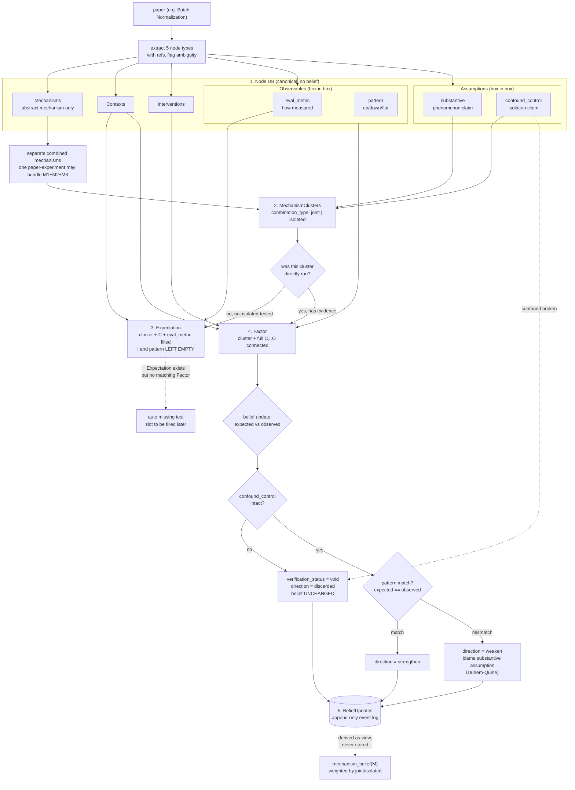

# AIO-System

**AIO PoC - Diagnostic World Model from Papers**

Proof-of-concept for **AIO** (Assumption-Intervention-Observable): compiling ML papers
into a factor graph that a reasoning agent can later query - not a RAG index, but a
world model that records *what was done, what was observed, why the authors think so,
and which beliefs each observation supports or weakens*.

## Core ideas

- **Words vs. sentences.** Canonical nodes (A/I/O/M/C) are the vocabulary; a *factor*
  is a sentence written with them. Vocabulary alone is retrieval - sentences make it a
  world model.
- **Votes are stored, beliefs are derived.** Each factor casts votes
  (`belief_update`: strengthen/weaken) at mechanism/assumption nodes. The
  supported / contested / weakened label lives only in the registry and is recomputed
  from the full record log - never edited by hand or by an LLM.
- **Append-only.** Records are immutable. New evidence (e.g., a 2018 rebuttal) is a new
  card; `git diff registry.json` then shows beliefs flipping while no card changed.
- **Observable = metric + pattern.** `O[E_xxx, P_xxx]` - results measured with
  different metrics are *incomparable*, not contradictory.
- **Expected outcomes are quoted-only.** Branch predictions enter a card only when the
  paper states them verbatim; otherwise `null`. No invented implications.

## Status

Bootstrap. The base-0 skeleton (schema, stub scripts, CI) is in place, and a working
Layer-1 extraction harness lives under `experiments/test_gemini/` (Gemini 2.5 Flash): it
turns a paper PDF into atomic AIO nodes (`spans.json`), then assembles flat factor records
(`factors.json`). Downstream stages - canonicalization, belief tally, and the static
world-model SVG - are not built yet. Query mode comes later.

Pilot paper: Batch Normalization (arXiv:1502.03167). Harness development ran on VARC
(Vision ARC) and TabEBM (arXiv:2409.16118).

## Layout

- `data/papers/`: source texts
- `data/records/`: factor cards (append-only)
- `registry/`: vocabulary + derived beliefs
- `schema/`: versioned factor card schema
- `prompts/`: versioned extraction prompts
- `scripts/`: validate / belief / viz
- `docs/`: key ideas & decision log
- `experiments/`: standalone extraction harnesses (see `experiments/test_gemini/`)

## AIO factor annotation format (v0.1)

Format file: `schema/factor.v0.1.annotation_format.jsonc`.
Machine-checkable schema: `schema/factor.v0.1.schema.json`.

```jsonc
{
  "factor_id": INT,
  "hypothesis": "...",
  "mechanisms": [
    {
      "text": "...",
      "mechanism_id": "M_xxx",
      "belief_update": [
        {
          "direction": "strengthen",
          "source": { "context_id": "C_xxx", "intervention_id": "I_xxx", "observable_id": "O_xxx" },
          "reason": {
            "assumption_id": ["A_xxx"],
            "mechanism_id": ["M_yyy"],
            "additional_text": "..."
          }
        }
      ]
    },
    {
      "text": "...",
      "mechanism_id": "M_yyy",
      "belief_update": [
        {
          "direction": "weaken",
          "source": { "context_id": "C_xxx", "intervention_id": "I_xxx", "observable_id": "O_xxx" },
          "reason": {
            "assumption_id": ["A_xxx"],
            "mechanism_id": ["M_xxx"],
            "additional_text": "..."
          }
        }
      ]
    }
  ],
  "assumptions": [
    {
      "text": "...",
      "assumption_id": "A_xxx",
      "belief_update": [
        {
          "direction": "weaken",
          "source": { "context_id": "C_xxx", "intervention_id": "I_xxx", "observable_id": "O_xxx" },
          "reason": {
            "assumption_id": ["A_yyy"],
            "mechanism_id": ["M_xxx"],
            "additional_text": "..."
          }
        }
      ]
    },
    {
      "text": "...",
      "assumption_id": "A_yyy",
      "belief_update": [
        {
          "direction": "strengthen",
          "source": { "context_id": "C_xxx", "intervention_id": "I_xxx", "observable_id": "O_xxx" },
          "reason": {
            "assumption_id": ["A_xxx"],
            "mechanism_id": ["M_xxx"],
            "additional_text": "..."
          }
        }
      ]
    }
  ],
  "context": "...",
  "intervention": "...",
  "observable": {
    "eval_metric": "E_xxx",
    "pattern": "P_xxx",
    "ref": "Table.2"
  },
  "expected_observable": {
    "eval_metric": "E_zzz",
    "pattern": "P_zzz"
  },
  "canonical_nodes": {
    "assumption_id": "A_xxx", "A_yyy",
    "mechanism_id": "M_xxx", "M_yyy",
    "context_id": "C_xxx",
    "intervention_id": "I_xxx",
    "observable_id": "O[E_xxx, P_xxx]"
  },
  "provenance": ["published_date", "paper_id", "section", "span/table"]
}
```

## Pipeline

extract (LLM, refs required, ambiguity flagged) -> **human check** -> canonicalize ->
**human check** -> fill C/I/O from tables -> attach A/M + votes -> **human check** ->
tally beliefs -> render graph -> **human check**

Every stage gates on researcher review (PR approval). CI grows with the repo:
JSON sanity -> schema validation -> registry freshness -> viz artifact.

## Model

Target model. The harness today covers the top of this flow (extract -> nodes -> flat
factor); mechanism clusters, expectation-vs-factor branching, and belief updates are the
design to build toward.


