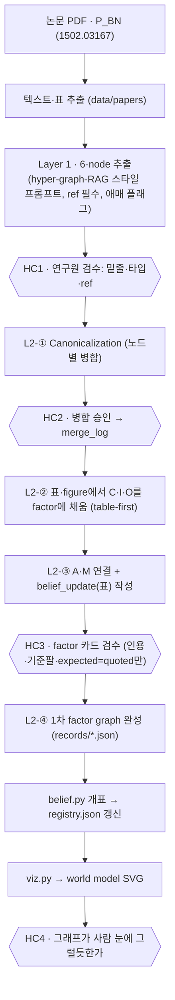
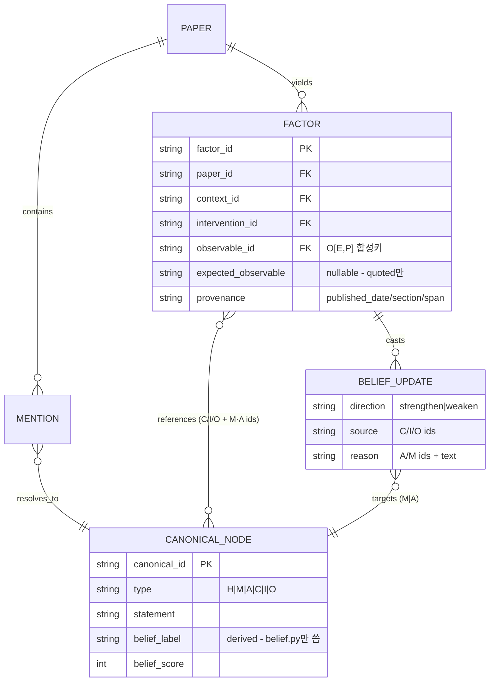

# AIO PoC — Key Ideas & Repo Bootstrap (v0.1)

- 날짜: 2026-07-03 · 용도: **Claude Code에 넘겨 빈 레포(base 0)를 잡고 Layer 1 실험을 준비**하기 위한 문서
- 성격: 명세서가 아니라 **키 아이디어 정리 + 부트스트랩 가이드**. 완벽 금지 — 지금 필요한 것만.
- 파일럿: **Batch Normalization** (Ioffe & Szegedy 2015, [arXiv:1502.03167](https://arxiv.org/abs/1502.03167)) 1편 → 최종적으로 factor graph 전체가 보이는 world model 시각화까지.
- 원칙: **모든 단계에 연구원 검수(HC, human checkpoint)가 끼어든다.** 자동화는 검수 사이의 다리일 뿐.

---

## 1. 키 아이디어 — 10줄 요약

1. **단어장과 문장.** 노드(A/I/O/M/C)는 단어장, factor는 그 단어들로 쓴 문장이다. 단어만 모으면 검색(RAG)이고, 문장이 있어야 world model이다.
2. **factor는 카드지 추론기가 아니다.** `expected_observable`은 factor가 계산하는 값이 아니라 지도에 미리 그려두는 갈림길 — **논문이 명시(인용 가능)했을 때만 채우고, 아니면 null** (지어내기 금지).
3. **표와 개표의 분리.** `belief_update` 항목 하나 = 이 factor가 어떤 M/A에 던지는 **표 1장**(방향+출처+근거). 개표 결과(supported/contested/weakened 라벨)는 factor에 저장하지 않고 **registry의 M·A 노드에서 파생**된다.
4. **지우개 금지 (append-only).** 카드는 절대 수정·삭제하지 않는다. 반박 논문이 오면 카드를 **추가**하고 개표만 다시 한다: $b(v) = F(\text{records})$. 2015 카드는 2015년 그대로 남는다 — `published_date`가 시간축.
5. **두 모드.** 지금은 **update mode**(L1/L2 구축 = 카드 추가 + 개표 재계산)만. **query mode**(빈칸 문장 → activation → derived 답)는 이후 단계 — 스키마에 슬롯만 남긴다.
6. **O = 자 + 눈금.** 관측은 `eval_metric`(어떻게 쟀나: E_xxx)과 `pattern`(무엇이 보였나: P_xxx)의 합성 — canonical O의 키는 `O[E_xxx, P_xxx]`. **자가 다르면 모순이 아니라 "비교 불가"**다.
7. **A는 결론이 아니라 전제.** H(상위 결론)는 서랍에(슬롯만, 사용 보류). M은 "왜"의 설명, A는 그 설명이 서기 위한 받침 — 실패 진단(δ)의 과녁은 주로 A다.
8. **기준팔 없는 관측은 무효.** "14배 빨라짐"은 무엇 대비인지 없으면 의미가 없다 (PoC에서는 intervention 텍스트에 "(vs 기준)" 관례로 기록).
9. **LLM 경계.** 문장을 쓰고 읽는 일(추출·문장화)은 LLM+사람 검증, 세고 고르는 일(개표·병합률)은 코드, **belief 라벨을 직접 만지는 일은 아무도 못 한다.**
10. **table-first.** factor의 뼈대(C·I·O·기준팔)는 논문의 표/figure가 거의 공짜로 준다 — 표에서 뼈대를 먼저 세우고, M/A는 본문·행간에서 채운다. (회의 질문 "table 먼저 보고 하면 되지 않을까요?" → 맞다, 확정.)

---

## 2. 확정 스키마 — AIO factor annotation format (v0.1)

아래는 회의에서 확정한 포맷 그대로이며, **문법 정규화 2건만** 반영했다(①`canonical_nodes`의 다중 값을 배열로 — JSON 유효성 ②`provenance`를 키 나열이 아니라 객체로). 의미 변경 없음.

```jsonc
{
  "factor_id": "P_BN_001",                    // INT도 허용하나 논문 접두사 문자열 권장 (충돌 방지)
  "hypothesis": null,                         // H는 서랍 — 슬롯만 유지, 기본 null
  "mechanisms": [                             // 복수 — 경쟁 M이 있어야 포크가 성립
    {
      "text": "ICS 감소가 학습을 가속한다",
      "mechanism_id": "M_xxx",
      "belief_update": [                      // ★이 factor가 M_xxx에 던지는 표(들)
        {
          "direction": "strengthen",          // strengthen | weaken
          "source": {                         // 표의 근거가 된 관측 셋업 (canonical id)
            "context_id": "C_xxx",
            "intervention_id": "I_xxx",
            "observable_id": "O_xxx"
          },
          "reason": {                         // 왜 이 방향인가
            "assumption_id": ["A_xxx"],       // 걸려 있는 전제들
            "mechanism_id": ["M_yyy"],        // 대안/경쟁 메커니즘 참조
            "additional_text": "..."          // 자유 서술 근거
          }
        }
      ]
    },
    { "text": "(경쟁) ...", "mechanism_id": "M_yyy", "belief_update": [ /* 동일 구조 */ ] }
  ],
  "assumptions": [                            // 복수 — 구조는 mechanisms와 동일
    { "text": "...", "assumption_id": "A_xxx", "belief_update": [ /* 동일 구조 */ ] },
    { "text": "...", "assumption_id": "A_yyy", "belief_update": [ /* 동일 구조 */ ] }
  ],
  "context": "...",                           // 무대 — 실험자가 정한 조건 (텍스트)
  "intervention": "... (vs 기준팔)",           // 행동 — 기준팔을 텍스트 관례로 포함
  "observable": {                             // 실제 본 것 = 자 + 눈금
    "eval_metric": "E_xxx",                   // 자: 어떻게 쟀나
    "pattern": "P_xxx",                       // 눈금: up/down/flat, aligned/diverging,
                                              //       robust-to-X/fragile-to-X, disappears-under-control ...
    "ref": "Table.2"                          // 원문 위치 — 수치는 참조로만
  },
  "expected_observable": {                    // ★논문이 명시(인용 가능)했을 때만 — 아니면 null
    "eval_metric": "E_zzz",
    "pattern": "P_zzz"
  },
  "canonical_nodes": {                        // 로컬 텍스트 ↔ 단어장 ID 매핑 (문법 정규화 ①)
    "assumption_ids": ["A_xxx", "A_yyy"],
    "mechanism_ids": ["M_xxx", "M_yyy"],
    "context_id": "C_xxx",
    "intervention_id": "I_xxx",
    "observable_id": "O[E_xxx, P_xxx]"        // 자+눈금 합성 키
  },
  "provenance": {                             // 문법 정규화 ② — 배열 → 객체
    "published_date": "2015-02",              // 시간축 — 오염 통제와 '그때의 믿음' 보존에 사용
    "paper_id": "P_BN",
    "section": "3-4",
    "span_or_table": "Fig.2"
  }
}
```

### 알려진 유예 항목 (스키마는 이대로 진행 — 알고만 있기)

| 항목 | 현재 처리 | 언제 다시 |
|---|---|---|
| `status`/`groundedness` 가중치 부재 | PoC 개표는 **±1 균일가중** (§4) | 가중 도입 = 스키마 v0.2 논의 (D5 기록) |
| `reference_arm` 전용 필드 없음 | `intervention` 텍스트에 "(vs 기준)" 관례 | v0.2 후보 |
| `belief_update`가 M/A 안에 위치 | 내용물은 **표(기여분)**임을 상기 — 개표 라벨은 registry에만 (§3) | 팀 온보딩 시 반복 강조 |
| C/I가 문자열 (O만 객체) | PoC OK | v0.2에서 `{id, text}` 대칭화 후보 |

---

## 3. Registry — 단어장 + 파생 belief가 사는 곳

factor에는 표만 저장되고, **개표 결과는 registry의 M·A 노드에 캐시**된다. 유일한 작성자는 `scripts/belief.py`.

```jsonc
{
  "canonical_id": "M_ics_reduction",          // 단어장 항목
  "type": "M",                                // H|M|A|C|I|O — belief는 M·A에만
  "statement": "ICS 감소가 학습을 가속한다",     // 자연어 1문장 (사람 검증용)
  "mention_refs": ["P_BN §1 span..."],        // 어느 밑줄들이 여기로 병합됐나
  "belief": {                                 // ★파생 캐시 — 진실의 원천은 records/
    "label": "supported",                     // supported | contested | weakened | unknown
    "score": 1,                               // PoC: Σ(±1)
    "n_strengthen": 1, "n_weaken": 0,
    "derived_from": ["P_BN_001"],             // 어느 factor의 표를 셌나 — 감사 추적
    "computed_at": "2026-07-03"
  }
}
```

merge 결정은 `registry/merge_log.md`에 "mention A + B → canonical_id, 근거 1문장"으로 남긴다 — 되돌릴 수 있게.

---

## 4. 개표 규칙 (PoC 버전 — 사전 등록, 결과 보고 변경 금지)

표에 가중치 필드가 없으므로 **균일가중**으로 시작한다:

$$s(v) = \#\text{strengthen}(v) - \#\text{weaken}(v)$$

$$\text{label}(v)=\begin{cases}\text{weakened} & \#\text{weaken}\ge 1 \ \wedge\ s(v)<0\\ \text{contested} & \#\text{weaken}\ge 1 \ \wedge\ s(v)\ge 0\\ \text{supported} & \#\text{weaken}=0 \ \wedge\ s(v)\ge 1\\ \text{unknown} & \text{otherwise}\end{cases}$$

```python
def belief(records, node_id):                  # 순수 함수: (카드 로그, M/A id) -> (score, label)
    ns = nw = 0                                # strengthen / weaken 표 수
    for r in records:                          # 모든 factor 카드 순회
        for grp in r.get("mechanisms", []) + r.get("assumptions", []):  # M·A 블록
            for bu in grp.get("belief_update", []):                     # 그 블록의 표들
                tid = grp.get("mechanism_id") or grp.get("assumption_id")  # 표의 과녁
                if tid != node_id: continue    # 이 노드를 향한 표만
                if bu["direction"] == "strengthen": ns += 1   # +1
                else: nw += 1                                  # -1
    s = ns - nw                                # 균일가중 합
    if nw >= 1 and s < 0:  return s, "weakened"     # 반박 있고 음수
    if nw >= 1:            return s, "contested"    # 반박 있으나 비음수
    if s >= 1:             return s, "supported"    # 지지만 존재
    return s, "unknown"                              # 표 없음
```

가중(관측 1.0 / 저자추론 0.7 / 인용 1.0 vs 추론 0.6)은 스키마에 필드가 생기는 v0.2에서 — 그때도 함수 교체만 하면 되도록 `belief.py` 하나에 격리한다.

---

## 5. 전체 흐름 — L1/L2와 검수 지점(HC)

회의에서 잡은 4단계(canonicalize → 표에서 CIO → AM 연결 → 1차 그래프)를 검수 지점과 함께 배선한 것.



모드 메모: 위 전체가 **update mode**다. query mode는 이 파이프라인 완주 후 별도 설계(빈칸 문장 → activation → derived 답) — 지금 레포에는 자리만 둔다.

### DB 스키마 스케치 (파일 기반 PoC — DB 도입 전의 논리 모델)



PoC는 전부 JSON 파일(`data/records/`, `registry/`)로 시작 — 이 ERD는 나중에 SQLite/그래프DB로 옮길 때의 지도다.

---

## 6. 폴더 구조 — base 0 (지금 만들 것 전부, 이게 다임)

```
aio-poc/
├── README.md                     # §9의 영어 텍스트 붙여넣기
├── docs/
│   ├── key_ideas.md              # 이 문서
│   └── decisions.md              # 사전 등록: 개표 규칙(§4)·expected 규칙·경계 규칙 (결정 로그)
├── data/
│   ├── papers/P_BN/              # 원문 PDF + 추출된 text/tables (읽기 전용 취급)
│   └── records/                  # ★factor 카드 JSON — append-only, 카드당 1파일
├── registry/
│   ├── registry.json             # 단어장 + 파생 belief 캐시
│   └── merge_log.md              # 병합 근거 로그
├── prompts/
│   └── extract_v1.md             # L1 추출 프롬프트 — 버전 고정 (프롬프트 = 컴파일러 스펙)
├── scripts/
│   ├── validate.py               # 스텁: JSON 파싱 + 필수 키 검사
│   ├── belief.py                 # 스텁: §4 개표 함수 + registry 갱신
│   └── viz.py                    # 스텁: records+registry → SVG (bipartite)
├── viz/                          # 생성물 (world_model.svg)
├── .github/workflows/ci.yml      # §8 Stage 0
└── requirements.txt              # jsonschema, networkx, graphviz
```

지금 안 만드는 것(의도적): query/, eval/, tests/ 폴더 — query mode와 평가는 다음 단계. 빈 폴더 선점은 완벽주의라 금지.

## 7. Layer 1 돌리기 전에 — 체크리스트 (순서대로, Mac 기준)

```bash
mkdir aio-poc && cd aio-poc && git init            # 1) 빈 레포
python3 -m venv .venv && source .venv/bin/activate # 2) 가상환경 (M2 Max 네이티브)
pip install jsonschema networkx graphviz           # 3) 최소 의존성
brew install graphviz                              # 4) SVG 렌더러 (viz.py용, 지금 설치만)
mkdir -p docs data/papers/P_BN data/records registry prompts scripts viz .github/workflows
git add -A && git commit -m "chore: base 0 skeleton" # 5) 뼈대 커밋 = 타임스탬프 시작
```

6. **BN 원문 준비**: [arXiv:1502.03167](https://arxiv.org/abs/1502.03167) PDF를 `data/papers/P_BN/`에, 텍스트와 표(특히 Fig.2 계열, BN-x5/x30 변형)를 별도 파일로 추출해 둔다 — L1 입력은 PDF가 아니라 이 텍스트다.
7. **`prompts/extract_v1.md` 작성** (스키마 강제는 프롬프트로 — 회의 과제 ①의 답):
   - §2 스키마 원문을 프롬프트에 통째로 동봉 + "JSON만 출력, 설명 금지"
   - 리트머스 질문 6개 포함 (H=팔려는 주장→null / M="왜?"의 답 / A="뭐가 거짓이면 무너지나" / C=세팅 / I=바꾼 것+기준 / O=자+눈금)
   - **ref 없는 항목 출력 금지** · `expected_observable`은 인용 가능할 때만, 아니면 null
   - 애매하면 값 대신 `"ambiguity_flags": ["..."]`에 적게 함 (HC1에서 연구원이 판정)
   - 안전망: 출력을 `validate.py`가 받아서 파싱 실패·필수키 누락 시 반려
8. **`docs/decisions.md`에 사전 등록**: §4 개표 규칙, expected=quoted-only, 경계 규칙 "한 factor = 한 개입 축 × 한 조건"(BN-x5·x30은 한 카드의 levels, Sigmoid 교체는 별도 카드)
9. **HC 담당 지정**: HC1(추출)·HC2(병합)·HC3(factor)·HC4(그래프) 각각 누가 승인하는지 이름 박기 — PR 리뷰와 1:1 대응

## 8. CI/CD — 단계에 맞게 (처음부터 완벽 금지)

| Stage | 시점 | CI가 하는 일 | 사람이 하는 일 (HC=PR 리뷰) |
|---|---|---|---|
| **0** (지금) | 빈 레포 | `data/records/*.json` 파싱 가능 여부만 | main 보호 + PR 필수 설정 |
| 1 | L1 첫 카드 후 | `validate.py`: 필수 키·ref 존재·expected에 인용 여부 | HC1: 밑줄·타입 검수 = approve |
| 2 | L2 병합·그래프 후 | `belief.py --check`: registry가 records와 일치하는지(stale 감지) + merge_log 갱신 여부 | HC2·HC3 |
| 3 | viz 후 | main 머지 시 `viz.py` 실행 → `world_model.svg` 아티팩트 | HC4: 그림이 그럴듯한가 |

Stage 0 `ci.yml` (이것만 지금 커밋):

```yaml
name: aio-ci                                   # 워크플로 이름
on: [pull_request]                             # 모든 PR에서 실행
jobs:
  json-sanity:
    runs-on: ubuntu-latest                     # CI는 리눅스 (로컬은 Mac 그대로)
    steps:
      - uses: actions/checkout@v4              # 체크아웃
      - run: |                                 # records의 모든 JSON이 파싱되는지만 검사
          python3 - <<'PY'
          import json, glob, sys
          bad = []                                        # 실패 목록
          for f in glob.glob("data/records/*.json"):      # 카드 전수
              try: json.load(open(f))                     # 파싱 시도
              except Exception as e: bad.append((f, e))   # 실패 기록
          sys.exit(1 if bad else 0)                       # 하나라도 깨지면 PR 차단
          PY
```

브랜치 규칙: `main` 보호(승인 1+ & CI green), 브랜치 명명 `l1/extract-bn`, `l2/canon`, `l2/factors`, `viz/first` — 커밋 접두사 `l1:` `canon:` `factor:` `belief:` `viz:` `docs:`. PR 템플릿 체크박스 5개: ref 전수 존재 / expected는 quoted 또는 null / 기준팔 명시 / merge_log 갱신(해당 시) / registry 재계산(해당 시).

## 9. README.md — 붙여넣을 영어 텍스트

```markdown
# AIO PoC — Diagnostic World Model from Papers

Proof-of-concept for **AIO** (Assumption–Intervention–Observable): compiling ML papers
into a factor graph that a reasoning agent can later query — not a RAG index, but a
world model that records *what was done, what was observed, why the authors think so,
and which beliefs each observation supports or weakens*.

## Core ideas
- **Words vs. sentences.** Canonical nodes (A/I/O/M/C) are the vocabulary; a *factor*
  is a sentence written with them. Vocabulary alone is retrieval — sentences make it a
  world model.
- **Votes are stored, beliefs are derived.** Each factor casts votes
  (`belief_update`: strengthen/weaken) at mechanism/assumption nodes. The
  supported / contested / weakened label lives only in the registry and is recomputed
  from the full record log — never edited by hand or by an LLM.
- **Append-only.** Records are immutable. New evidence (e.g., a 2018 rebuttal) is a new
  card; `git diff registry.json` then shows beliefs flipping while no card changed.
- **Observable = metric + pattern.** `O[E_xxx, P_xxx]` — results measured with
  different metrics are *incomparable*, not contradictory.
- **Expected outcomes are quoted-only.** Branch predictions enter a card only when the
  paper states them verbatim; otherwise `null`. No invented implications.

## Status
Bootstrap (base 0). Pilot paper: Batch Normalization (arXiv:1502.03167).
Current scope: Layer 1 (node extraction) → Layer 2 (canonicalize, table-first factor
assembly, first graph) → belief tally → static world-model SVG. Query mode comes later.

## Layout
data/papers · source texts | data/records · factor cards (append-only) |
registry/ · vocabulary + derived beliefs | prompts/ · versioned extraction prompts |
scripts/ · validate / belief / viz | docs/ · key ideas & decision log

## Pipeline
extract (LLM, refs required, ambiguity flagged) → **human check** → canonicalize →
**human check** → fill C·I·O from tables → attach A·M + votes → **human check** →
tally beliefs → render graph → **human check**

Every stage gates on researcher review (PR approval). CI grows with the repo:
JSON sanity → schema validation → registry freshness → viz artifact.
```

## 10. BN 실험 — "끝났다"의 정의 + 시각화 목표

| 산출물 | 기준 |
|---|---|
| `data/records/P_BN_*.json` | factor 5–8장, 전 카드 ref 존재, expected는 quoted 또는 null |
| `registry/registry.json` | 노드 15–25개, M·A에 belief 라벨, `merge_log.md` 근거 존재 |
| `viz/world_model.svg` | **bipartite**: 변수 노드(타원, 타입별 색 H/M/A/C/I/O) ↔ factor(사각, 논문색 테두리), δ 표는 factor→M·A 화살표(strengthen 청록/weaken 빨강) |
| 스트레치 데모 | Santurkar([1805.11604](https://arxiv.org/abs/1805.11604)) 카드 1장 append → `git diff registry.json`에서 M_ics가 supported→contested로 뒤집힘 — "카드는 안 고쳤는데 믿음이 갱신됐다" 한 장면 |
| D5 메모 | 애매했던 판정·스키마 유예 항목 체감 기록 → v0.2 재료 |

최종 그림의 확장 방향: PoC는 정적 SVG(`graphviz`) → 이후 쿼리 버튼으로 부분그래프가 켜지는 인터랙티브 HTML(이미 채팅에서 프로토타입한 explorer 스타일).

## 11. 회의의 열린 과제 4개 — 현재 답

| 과제 | 답 |
|---|---|
| 스키마대로 출력 강제 — 프롬프트로만? | 예 + 안전망 2중: 프롬프트에 스키마 동봉·"JSON만"·prefill `{` 기법, 실패는 `validate.py`가 반려 (CI Stage 1) |
| belief score? +/−만? | **PoC는 ±1 균일** (§4, 사전 등록) — 스키마에 가중 필드가 없으니 정직한 선택. 가중(관측/저자추론, 인용/추론)은 v0.2에서 필드와 함께 |
| 어떻게 추출? | 섹션 단위 청킹 → 6-node 동시 추출(hyper-graph-RAG 스타일) + ref 필수 + ambiguity_flags → HC1 판정. 프롬프트가 곧 컴파일러 스펙이므로 `prompts/`에 버전 고정 |
| factor로 어떻게 묶나 — table 먼저? | **확정: table-first.** 표의 행그룹 = factor 후보, 뼈대(C·I·O·기준) 자동 → M/A만 본문·행간에서. 경계 규칙 "한 factor = 한 개입 축 × 한 조건" |

## 12. 바로 다음 액션 (오늘)

1. §7의 명령 5줄로 뼈대 커밋 → 2. README 붙여넣기 → 3. `ci.yml`(Stage 0) 커밋 → 4. BN 텍스트·표 넣기 → 5. `extract_v1.md` 초안 → 6. HC 담당 이름 박기. 여기까지가 base 0 완료 — 그다음이 Layer 1 첫 실행이다.
